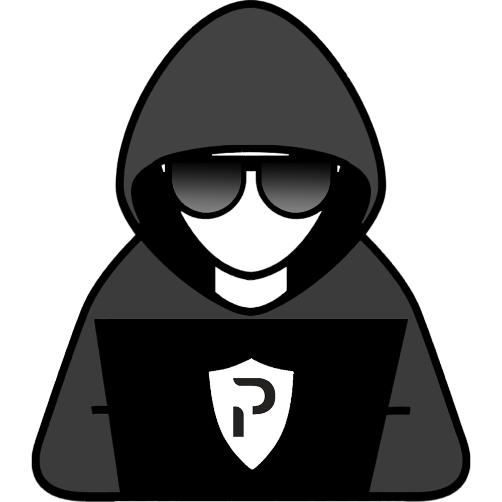

<div id="top"></div>


<br />
<div align="center">
  <a href="https://github.com/BrandonGrover/investigation_toolbox">
    
  </a>

<h3 align="center">Investigation Toolbox</h3>

  <p align="center">
    The all-in-one toolbox to help investigate security incidents and provide context and enrichment along the way.
    <br />
    <br />
    <br />
  </p>
</div>


<!-- ABOUT THE PROJECT -->
## About The Project

Here's a blank template to get started: To avoid retyping too much info. Do a search and replace with your text editor for the following: `github_username`, `repo_name`, `twitter_handle`, `linkedin_username`, `email_client`, `email`, `project_title`, `project_description`


<!-- GETTING STARTED -->
## Getting Started

This is an example of how you may give instructions on setting up your project locally.
To get a local copy up and running follow these simple example steps.

### Prerequisites

This is an example of how to list things you need to use the software and how to install them.
* npm
  ```sh
  npm install npm@latest -g
  ```

### Installation

1. Rename docs/api_keys-example.json to api_keys.json
2. Enter API keys for each service
3. 


<!-- ROADMAP -->
## Roadmap

- [ ] More OSINT APIs
- [ ] Office 365 Activities API
- [ ] CrowdStrike API
- [ ] Mimecast API
- [ ] 


<!-- CONTACT -->
## Contact

Your Name - Brandon Grover

Project Link: [Investigation Toolbox](https://github.com/BrandonGrover/investigation_toolbox)


<!-- ACKNOWLEDGMENTS -->
## Acknowledgments

* []()
* []()
* []()

<p align="right">(<a href="#top">back to top</a>)</p>


<!-- MARKDOWN LINKS & IMAGES -->
<!-- https://www.markdownguide.org/basic-syntax/#reference-style-links -->
